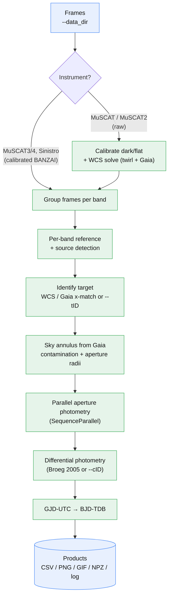

# prose2

prose2 extends the [prose](https://github.com/lgrcia/prose) astronomical
image-processing framework with an **end-to-end, command-line multi-band
photometry pipeline**: `prose/scripts/run_photometry.py`.

> For the base prose package — `Sequence`s, `blocks`, and the core pipeline
> concepts — see the original
> [prose README](https://github.com/lgrcia/prose/blob/main/README.md) and
> [documentation](https://prose.readthedocs.io/en/latest). prose2 reuses that
> machinery; this README documents only the `run_photometry` tool.

## `run_photometry`

Given a directory of science frames for a single target, `run_photometry`
produces calibrated multi-band light curves with a single command:

```shell
python -m prose.scripts.run_photometry \
    --target_name TOI-6715 \
    --data_dir /data/MuSCAT4/250416 \
    --results_dir output
```

### Pipeline



> Tip: on GitHub the diagram pans/zooms, and the highlighted nodes are
> clickable — they jump to the matching section below.

### What it does

For each photometric band it:

1. groups frames per band for the requested target,
2. builds a per-band reference image and detects sources,
3. identifies the target via WCS / Gaia cross-match (or an explicit `--tID`),
4. sizes the sky annulus to exclude Gaia contaminants (≥10 % of the target
   flux, Δmag < 2.5) and sets aperture radii from the target FWHM up to that
   annulus,
5. runs aperture photometry in parallel (`prose.SequenceParallel`),
6. performs automatic differential photometry (Broeg et al. 2005), or uses the
   comparison stars you pass with `--cID`,
7. converts GJD-UTC to BJD-TDB (astropy light-travel by default;
   `--use_barycorrpy` to use barycorrpy — requires `astroplan`), and
8. writes per-band and multi-band data products.

### Supported instruments & input

| Instrument | Input | Notes |
|---|---|---|
| LCO MuSCAT3 / MuSCAT4 | calibrated BANZAI frames (e.g. `*-e91.fits`) | each band is a separate camera; bands self-reference by default |
| LCO Sinistro | calibrated BANZAI frames | single band (supply `--tID` manually for some datasets) |
| MuSCAT (1) | raw frames | calibrated on the fly (dark/flat) and WCS-solved via twirl + Gaia; pass `--muscat_calib_dir` to keep the calibrated FITS |
| MuSCAT2 | raw frames | calibrated on the fly and WCS-solved; pass `--muscat2_calib_dir` |

Multi-camera MuSCAT bands each self-reference their own first frame, which is
correct when every band is a separate camera. Pass `--ref_band gp` to instead
align all bands to one band's frame.

### Output products

Everything is written to `--results_dir`:

- **per band:** `…_ref.png`, `…_apertures.png`, `…_alignment.png`,
  `…_{band}.csv`, and an optional `….gif`
- **multi-band:** `…_lightcurves.png`, `…_raw_flux.png`, `…_covariates.png`,
  `…_stacks.png`
- a single `….npz` archive and a timestamped `.log`

### Options

| Group | Options |
|---|---|
| Target | `--target_name` (required), `--target_coord`, `--tID`, `--cID`, `--avoid_cids` |
| Input / output | `--data_dir`, `--results_dir`, `--glob`, `--overwrite` |
| Bands & reference | `--bands`, `--ref_band`, `--refid` |
| Apertures | `--aper_radii`, `--annulus`, `--aper_unit` (see below) |
| Detection / PSF / alignment | `--min_star_separation`, `--min_star_area`, `--max_num_stars`, `--n_stars_align`, `--cutout_size`, `--ccd_trim` |
| Time & plots | `--use_barycorrpy`, `--bin_size_minutes`, `--plot_gaia_sources`, `--gif`, `--gif_stride` |
| MuSCAT raw calibration | `--muscat_calib_dir`, `--muscat2_calib_dir` |
| Run control | `--test_run`, `--test_run_frames`, `--verbose` |

`--gif` is off by default because GIF rendering is the slowest stage; throttle
it with `--gif_stride`. `--test_run` reduces each band to its first few frames
(`--test_run_frames`) for a quick smoke test.

`--plot_gaia_sources` overlays the queried Gaia source positions (projected
into each cutout's WCS and labelled with their `G` magnitude) on the target
zoom panels of the `*_apertures.png` and `*_stacks.png` figures, so you can see
which Gaia stars the sky annulus was sized to exclude. It reuses the per-run
Gaia cache, so the only extra query happens when you combine it with an
explicit `--aper_radii` grid (which otherwise skips Gaia entirely).

### Custom aperture grid

By default the aperture runs from the target FWHM up to the inner sky annulus.
The sky annulus is nominally 6–10×FWHM but is shifted inward to exclude any
Gaia source contributing ≥10% of the target flux (Δmag < 2.5), and `rout` is
clamped to 100 px when the FWHM is large (defocus). The Gaia result is cached
under `~/.cache/prose_photometry/gaia/` (keyed by target coordinates); if Gaia
is unreachable on a later run the cached result is reused, and if no cache
exists an FWHM-only annulus is used. To set an explicit grid (and skip the Gaia
query entirely), use `--aper_radii MIN,MAX,DR` together with
`--annulus RIN,ROUT`. The grid is **inclusive of MAX** (`10,20,2` →
`[10, 12, 14, 16, 18, 20]`). `--aper_unit` selects the unit for both flags:

```shell
# radii in pixels
python -m prose.scripts.run_photometry ... \
    --aper_radii 10,40,3 --annulus 44,52 --aper_unit pix

# radii in units of the per-image FWHM
python -m prose.scripts.run_photometry ... \
    --aper_radii 1,5,0.5 --annulus 6,8 --aper_unit fwhm
```

`--annulus` is required whenever `--aper_radii` is given, and `--annulus` /
`--aper_unit` only apply together with `--aper_radii`.

### Reliability notes

- **Malformed coordinates.** MuSCAT2/TCS headers can write a sexagesimal
  seconds field outside `[0, 60)` (e.g. DEC `+20:11:181`); these are parsed by
  carrying the overflow instead of failing, so WCS solving and Gaia queries
  proceed.
- **Network timeouts.** Every external query (Gaia, SIMBAD, MAST/TIC, and the
  BJD service) is bounded by a wall-clock timeout
  (`prose.utils.NETWORK_TIMEOUT_S`, 30 s) so an unreachable service degrades to
  a cached result or skips astrometry rather than hanging the run.
- **Comparison-star bounds.** Out-of-range `--cID` values are dropped with a
  warning and fall back to automatic selection rather than crashing.
- **Avoided stars.** With `--ref_band`, IDs passed to `--avoid_cids` are
  excluded from comparison-star selection and omitted from each `…_ref.png`.

## Example datasets

* sinistro: 250523
* muscat4 (broadband): 250416, 250512
* muscat3 (narrowband): 240122
* muscat4: 240128 (supply `--tID` manually)

## Installation

prose2 builds on prose (Python 3). Install prose from
[PyPI](https://pypi.org/project/prose/):

```shell
pip install prose
```

or the latest development version:

```shell
pip install 'prose @ git+https://github.com/lgrcia/prose'
```

## Attribution

`run_photometry` is built on prose. If you use it for research, please cite
[Garcia et al. 2022](https://ui.adsabs.harvard.edu/abs/2022MNRAS.509.4817G):

```
@ARTICLE{prose,
       author = {{Garcia}, Lionel J. and {Timmermans}, Mathilde and {Pozuelos}, Francisco J. and {Ducrot}, Elsa and {Gillon}, Micha{\"e}l and {Delrez}, Laetitia and {Wells}, Robert D. and {Jehin}, Emmanu{\"e}l},
        title = "{PROSE: a PYTHON framework for modular astronomical images processing}",
      journal = {\mnras},
     keywords = {instrumentation: detectors, methods: data analysis, planetary systems, Astrophysics - Instrumentation and Methods for Astrophysics, Astrophysics - Earth and Planetary Astrophysics},
         year = 2022,
        month = feb,
       volume = {509},
       number = {4},
        pages = {4817-4828},
          doi = {10.1093/mnras/stab3113},
archivePrefix = {arXiv},
       eprint = {2111.02814},
 primaryClass = {astro-ph.IM},
       adsurl = {https://ui.adsabs.harvard.edu/abs/2022MNRAS.509.4817G},
      adsnote = {Provided by the SAO/NASA Astrophysics Data System}
}
```

See also how to cite the dependencies of your sequences
[here](https://prose.readthedocs.io/en/latest/ipynb/acknowledgement.html).
