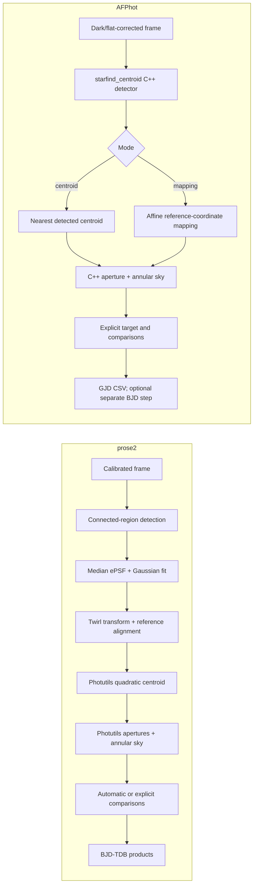

# prose2 versus MuSCAT AFPhot

## Scope

This is a source-code comparison of the production CLI in
`prose/scripts/run_photometry.py` with the MuSCAT3 wrappers under
`/ut2/muscat/reduction_afphot/muscat3/scripts`. That directory is a symbolic
link to the shared AFPhot scripts in
`/ut3/muscat/reduction_afphot/tools/scripts`; the core photometry programs are
Perl wrappers and compiled C++ tools under
`/ut3/muscat/reduction_afphot/tools/afphot`.

AFPhot exposes two production paths, `centroid` and `mapping`, so both are
included. Obsolete scripts and commented-out alternatives are excluded. This
is not a numerical benchmark: no common image set was reduced by both
pipelines here.

## Pipeline overview

## Detailed comparison

| Stage | prose2 | AFPhot | Practical consequence |
|---|---|---|---|
| Primary interface | One Python CLI covering grouping, reduction, differential photometry, time conversion, plots and archives | Multiple Perl orchestration scripts plus parameter files and compiled C++ executables | prose2 is easier to reproduce from one recorded command; AFPhot exposes more of the traditional reduction as explicit intermediate files |
| MuSCAT3 input | Uses calibrated BANZAI frames | Works from AFPhot's dark/flat-corrected `df` products and has separate configuration/calibration scripts | The compared entry points do not start from identical products |
| Source detection | `PointSourceDetection`: global threshold near median + 4 sigma, connected-component labeling with scikit-image, area filtering, peak sorting and minimum-separation cleaning | `starfind_centroid`: noise-aware C++ resolver at a configured 10-sigma threshold, a 20-pixel aperture, at least 10 above-threshold pixels and at least 10,000 ADU aperture flux; up to 1,100 detections by default | AFPhot's detector is more explicitly instrument-tuned and flux/area gated; prose2 is simpler and configurable from the CLI |
| Source position | Region centroid followed by adaptive Photutils refinement: quadratic for compact PSFs and center-of-mass for broad/defocused PSFs | Detector outputs both centroid-like and intensity positions; centroid mode selects the nearest per-frame detected centroid to each reference position | Both depend on successful per-frame detection, but their centroid definitions and search behavior differ |
| Frame registration | Twirl transform from detected stars, then reference-source alignment; skipped only when fewer than three alignment stars are requested | Centroid mode estimates translation from the mean (one/two stars) or component-wise median (three or more) of nearest matches. Mapping mode uses `testmatch` to derive translation plus a 2x2 affine matrix | AFPhot mapping and prose2 both support more than translation. AFPhot centroid mode assumes little rotation/distortion |
| Applying registration | Reference sources are aligned to each science frame, then adaptively centroid-refined | Mapping mode applies the affine transform directly to reference coordinates; it does not resample the image. Centroid mode uses detected positions nearest to untransformed reference coordinates | AFPhot mapping is attractive when a defocused star's own centroid is unstable, provided the field transform is reliable |
| PSF/FWHM | Builds a median ePSF from 35-pixel cutouts and fits a 2D Gaussian with Astropy/SciPy | The aperture program reports FWHM from pixel intensities/radii; it does not fit a Gaussian PSF in the inspected production path | prose2 obtains a coherent model and scale but imposes a Gaussian/finite-cutout assumption; AFPhot is less model-dependent |
| Apertures | Photutils circular apertures. A radius grid is evaluated in one sequence; defaults are derived from measured FWHM and the inner sky radius, or may be supplied in pixels/FWHM units | The wrapper reruns the C++ `apphot` executable once per requested fixed pixel radius | prose2 avoids repeated detector/photometer setup across radii; AFPhot's fixed-pixel grid is simple and historically tuned |
| Aperture centering | Adaptive Photutils quadratic/center-of-mass centroid after alignment, with FWHM-scaled cutout and displacement validation | Configured `hbox=0`, so the C++ photometer does not search around the supplied center despite supporting such a search | prose2 adapts to broad PSFs; AFPhot relies entirely on detector centroids or mapped coordinates with the inspected MuSCAT3 parameters |
| Fractional pixels | Photutils aperture-overlap calculation | C++ code explicitly applies fractional weights at the aperture boundary | Both support fractional aperture pixels |
| Local sky | Photutils annulus; sigma-clipped Astropy statistics. Default geometry is FWHM/Gaia-aware and the outer radius is clamped to 100 pixels under large defocus | C++ annulus fixed at radii 50--90 pixels (`sky_sep=50`, `sky_wid=40`) with iterative 3-sigma rejection and median sky in the inspected source | AFPhot's large fixed annulus is clearly tuned for broad MuSCAT PSFs. prose2 adapts to PSF size and catalogued contaminants but depends on a trustworthy FWHM and WCS/Gaia information |
| Noise/error model | Photometry is measured by Photutils; downstream differential errors are propagated through prose's flux processing | C++ model includes source, sky scatter, finite-sky, read, dark and scintillation terms using configured detector/telescope parameters | AFPhot exposes a more explicit physical single-frame uncertainty model in this path |
| Bad pixels/saturation | Optional bad-pixel map is converted to NaNs; saturated and edge/nearby comparison stars are excluded where possible | Detector and photometer use configured ADU limits (-1,000 to 130,000). The C++ output counts bad pixels, but light-curve assembly uses a permissive `nbadpix >= 1000` rejection threshold | prose2 has stronger comparison-pool safeguards; AFPhot directly feeds detector noise and ADU limits into its native tools |
| Target selection | WCS/Gaia match, pixel override or explicit ID; warns and can fall back to the brightest source | Explicit target ID from the operator/reference object list | prose2 is more automated; AFPhot makes identity an operator-controlled input |
| Comparison stars | Explicit IDs or automatic Broeg et al. (2005) weighting after NaN handling, clipping and exclusion of saturated, nearby and edge stars | Explicit comparison IDs; their fluxes are summed without weighting, then target/sum is median-normalized | prose2 provides automatic ensemble selection; AFPhot is more transparent but depends more on manual choice |
| Differential uncertainty | Propagates target and summed-comparison errors | Also propagates target and summed-comparison errors analytically | The high-level ratio calculation is comparable when prose2 is given explicit, equally weighted comparisons |
| Time | Normalizes instrument headers to JD and converts GJD-UTC to BJD-TDB with Astropy, optionally barycorrpy | Writes mid-exposure GJD minus 2,450,000. A separate `jd2bjd4apphotlc.pl` call is only triggered when RA/Dec are supplied to the collector; the inspected `auto_mklc.pl` does not supply them | prose2's standard products consistently include BJD-TDB; AFPhot's default wrapper output remains GJD |
| Execution | Per-frame work uses `SequenceParallel` | Wrappers process frames and aperture radii serially through shell commands | prose2 should scale better across many frames/cores, but this comparison did not benchmark runtime |
| Outputs | Per-band and combined CSV, PNG, GIF, NPZ and log products | Per-frame object, shift/geometry and aperture files plus per-band light-curve CSV | AFPhot preserves more inspectable intermediate text products; prose2 produces a richer packaged science result |

## Defocused-star implications

Neither implementation demonstrates detection reliability through tests or a
completeness benchmark in the inspected code. Nevertheless, AFPhot contains
more explicit accommodations for strongly broadened MuSCAT PSFs:

- Its detector integrates and validates candidates in a 20-pixel aperture
  instead of relying only on a compact Gaussian kernel.
- Its sky annulus is deliberately far from the center (50--90 pixels).
- Mapping mode can place apertures from a field transform without trusting the
  target's per-frame centroid.
- Its aperture photometer does not require a Gaussian PSF model.

prose2 can handle moderate smooth defocus when the connected source remains
above threshold and inside the 35-pixel PSF cutout, and its aperture/annulus
selection explicitly expands with measured FWHM. Its weakest points for severe
defocus are the connected-region detection threshold, peak-based source
ranking, the fixed 35-pixel ePSF cutout, and the Gaussian FWHM fit. Centroid
refinement now switches from quadratic to center-of-mass for broad PSFs, uses
an FWHM-scaled cutout and rejects excessive movement. Ring-shaped or very broad
low-surface-brightness profiles can still fragment, merge, be ranked too
faintly, or yield a misleading Gaussian FWHM that affects that policy.

AFPhot mapping remains an important baseline for severely defocused or
donut-like stars, but not a proven winner: its 10-sigma detection
threshold, fixed 20-pixel detection aperture, nearest-neighbor associations
and fixed 50--90-pixel sky annulus can also fail as PSF size, crowding or drift
changes. The conclusion should be validated on common frames with injected or
catalogued stars before changing the production pipeline.

## Notable implementation risks

### prose2

- Source detection and PSF modeling are not covered by defocused-star
  completeness/regression tests.
- The estimated FWHM controls later aperture geometry, so a poor Gaussian fit
  can affect several downstream choices.
- Global connected-component thresholding has no local background model or
  deblending stage.

### AFPhot

- `apphot_centroid.pl` matches every reference star to the nearest detection
  independently and does not enforce a maximum distance or unique assignment.
  Multiple reference IDs can therefore select the same detection.
- `calc_dxdy.pl` has the same unconstrained nearest-neighbor issue while
  estimating translation.
- In `mklc_flux_collect_csv.pl`, missing shift entries are compacted before a
  median based on the total frame count is selected, which can mis-estimate the
  centering offset when files are absent.
- The bad-pixel light-curve cut is set to 1,000 even though a stricter value of
  3 remains commented out.
- The wrappers construct shell command strings and depend on working-directory
  layout, symlinks and mutable parameter files, making exact provenance harder
  to capture than a single prose2 invocation.
- The executable named `apphot` is a compiled binary; the repository contains
  several historical C++ versions. The algorithm statements above use the
  inspected production wrapper, current MuSCAT3 parameters and the newest
  matching source file, but build provenance is not embedded in the wrapper.

## Recommended validation

Run both pipelines on the same calibrated MuSCAT3 frames, separately for
focused, moderately defocused and donut-like sequences. Match results to Gaia
or a curated reference list and measure:

1. detection completeness and false detections versus magnitude and PSF size;
2. duplicate/missed source assignments;
3. centroid or mapped-position residuals;
4. recovered aperture flux versus radius;
5. sky bias as the annulus crosses PSF wings or nearby stars;
6. target light-curve RMS, red-noise beta and outlier rate; and
7. runtime and rejected-frame fraction.

Until that test exists, the safest operational summary is: use AFPhot mapping
as the established defocus-oriented baseline, and treat prose2's increased
automation and richer safeguards as promising but not evidence of superior
defocused-star performance.

## Files inspected

### prose2

- `prose/scripts/run_photometry.py`
- `prose/blocks/detection.py`
- `prose/blocks/centroids.py`
- `prose/blocks/photometry.py`
- `prose/blocks/psf.py`
- `prose/fluxes.py`

### AFPhot

- `auto_apphot_centroid.pl`, `auto_apphot_mapping.pl`, `auto_mklc.pl`
- `starfind_centroid.pl`, `calc_dxdy.pl`, `starmatch.pl`
- `apphot_centroid.pl`, `apphot_mapping.pl`, `mklc_flux_collect_csv.pl`
- MuSCAT3 `param-starfind_centroid.par`, `param-apphot.par`,
  `param-match.par`, `param-ccd.par` and `param-fitsheader.par`
- `src/starfind/starfind_centroid.cpp`
- `src/apphot/apphot_v2.6.0.cpp`
- `src/match/testmatch.cpp`
